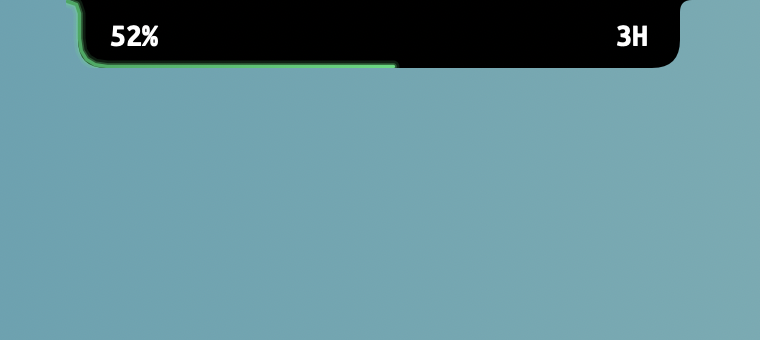
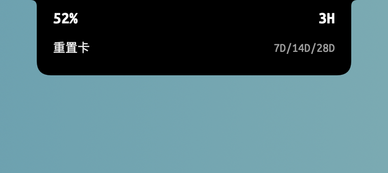

# Codex Meter

[中文](README.md) · [Privacy](PRIVACY.md) · [Security](SECURITY.md)

Codex Meter is a lightweight native macOS utility that displays local Codex usage around the physical MacBook notch.

- Remaining percentage on the left
- Time until reset on the right, using `D`, `H`, and `M`
- A green, yellow, or red gradient along the notch edge
- Reset-credit expirations in a compact hover panel
- Full rate-limit details, refresh, launch-at-login, and quit actions in the click menu

> [!IMPORTANT]
> This is an unofficial community project. It is not affiliated with or endorsed by OpenAI. Codex is a product and trademark of OpenAI.

## Preview

| Default | Hover |
| --- | --- |
|  |  |

## How it works

The app launches the locally installed `codex app-server --stdio` process and reads the rate limits associated with the current local Codex login. It does not implement its own authentication flow and does not ask for or persist access tokens.

If an account has been synchronized by auth.js or another tool, it will work when the local Codex app-server recognizes that login state.

Usage snapshots remain in memory only. Authentication and network access are handled by the local Codex process. See [PRIVACY.md](PRIVACY.md) for details.

## Requirements

- macOS 14 or later
- Apple Silicon or Intel Mac
- Apple Command Line Tools
- A signed-in Codex CLI, Codex App, or ChatGPT App installation

Notched displays use the physical-notch layout. Other displays fall back to a centered top capsule.

## Build and run

```sh
git clone https://github.com/ifryan/codex-meter.git
cd codex-meter
./build-app.sh
open "dist/Codex Meter.app"
```

The default build is Universal 2. Development builds use an ad-hoc signature and are intended for local use only.

Build Apple Silicon only:

```sh
ARCHS=arm64 ./build-app.sh
```

Persist a non-standard Codex executable path and restart the app:

```sh
defaults write io.github.ifryan.codexmeter codexExecutablePath /absolute/path/to/codex
```

After moving the app to `/Applications`, click the notch and select the launch-at-login menu item if desired.

## Development

```sh
swift test
./build-app.sh
```

The app-server protocol is currently experimental. Please include the Codex version when reporting compatibility problems, but never attach tokens, cookies, or a complete private configuration file.

See [CONTRIBUTING.md](CONTRIBUTING.md) for contribution guidelines.

## License and acknowledgements

Codex Meter is licensed under [GPL-3.0-only](LICENSE). The visual design was informed by [Atoll](https://github.com/Ebullioscopic/Atoll) and [boring.notch](https://github.com/TheBoredTeam/boring.notch). Ubuntu Mono is distributed under its own license in [Resources/Fonts/LICENCE.txt](Resources/Fonts/LICENCE.txt). See [NOTICE.md](NOTICE.md).
